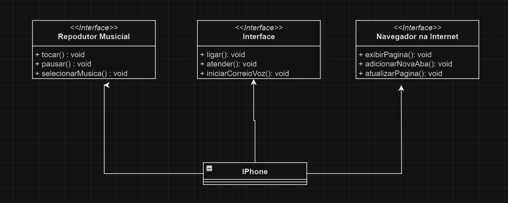

## Projeto de desafio de POO com Java

Neste projeto foi desenvolvido minhas habilidades com criação de diagramas UML e do código fonte.

## UML Criado para o projeto:

O projeto disponibiliza de uma classe `main` que no caso seria o usuário. Através dessa classe que irá rodar os componente solicitados utilizando os conceitos aprendidos de POO.

Criado por `Gabriel do Amaral`.
